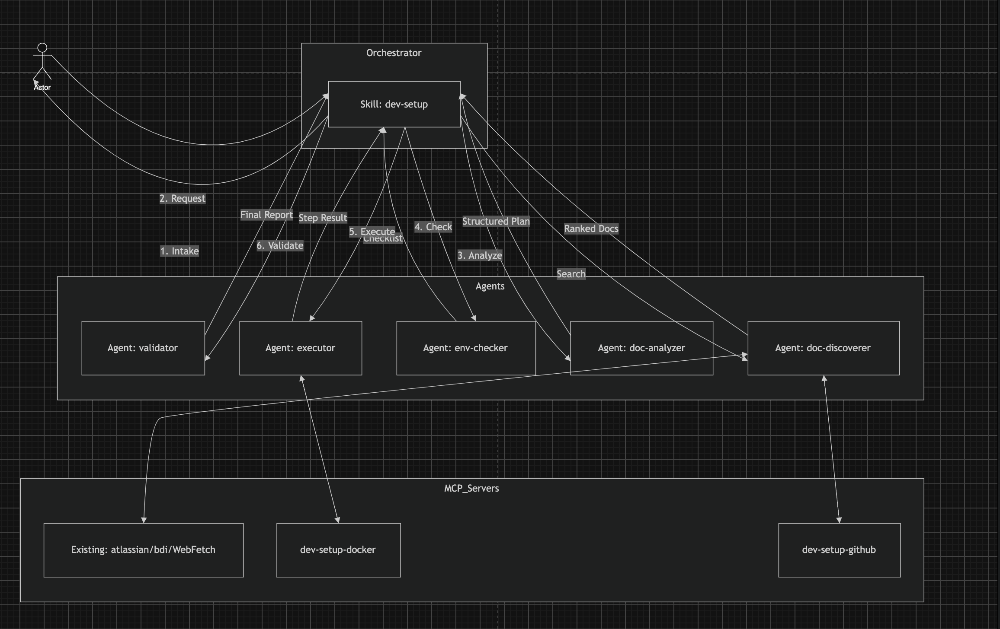

# Architecture

## Overview

The Onboarding Assistant is built around a central orchestrator skill (dev-setup) that coordinates five specialized agents in sequence. Each agent has a single responsibility and returns its output back to the skill before the next phase begins.

## Flow

1. Intake — the skill collects what the user wants to set up
2. Search — doc-discoverer searches GitHub, Confluence, and external docs, returns ranked sources
3. Analyze — doc-analyzer parses the selected docs into a structured setup plan
4. Check — env-checker verifies installed tools and environment variables
5. Execute — executor runs each step after user confirmation, returns step results
6. Validate — validator smoke tests the completed setup, returns final report

## MCP Servers

Three MCP server groups are used:

- dev-setup-github — custom server wrapping the gh CLI for GitHub repo and README access
- dev-setup-docker — handles Docker and Docker Compose lifecycle operations
- Existing (atlassian / bdi / WebFetch) — Confluence, Jira, SAP wiki, and external HTTP docs
